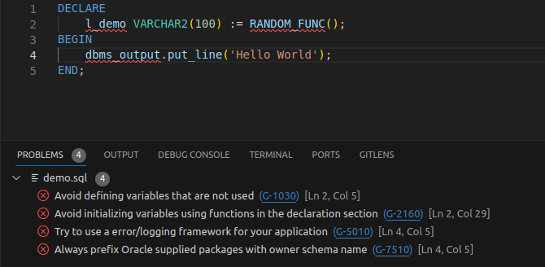

# sqlcl-codescan README

This extension adds the SQLcl codescan ability to VS Code

## Features

Allows the usage of [SQLcl codescan](https://docs.oracle.com/en/database/oracle/sql-developer-command-line/23.3/sqcug/codescan-command.html#GUID-A0920135-A6BE-4413-9E71-D11DA1F2A60E) in VS code for any given sql file

## Requirements

A working installation of [SQLcl](https://www.oracle.com/database/technologies/appdev/sqlcl.html) above version 23

## Extension Settings

This extension contributes the following settings:

* `sqlclCodescan.checkOnSave`: Check files on save
* `sqlclCodescan.checkOnOpen`: Check files on open
* `sqlclCodescan.sqlClPath`: Path to sqlcl executable
* `sqlclCodescan.ignorePaths`: List of paths to ignore similar to .gitignore
* `sqlclCodescan.enableFormatting`: Enable sql formatting
* `sqlclCodescan.formattingRulePath`: Path to advanced formatting rules xml
* `sqlclCodescan.tvdFormatterPath`: Path to format.js to load tvdformatter script
* `sqlclCodescan.tvdArboriPath`: Path to tvd custom formatting arbori file
* `sqlclCodescan.websiteInfo`: URL where details about the rules can be found

## Known Issues

## Release Notes

### 1.0.0

* Initial release of sqlcl-codescan

### 1.1.0

* dded severity level to diagnostics
* Added code formatting capability

### 1.1.1

* Added support for UTF-8 BOM encoded files
* Showing results in vscode output channel

### 1.1.2

* Refactored stdin/out handling for sqlcl
* Improved output channel info
* Improved error handling for failing scans

### 1.1.3

* Fixed handling when no error occured

### 1.1.4

* Fixed an issue caused by absolute paths for formatting rules or arbori file
* Fixed issues caused by whitespace in paths for formatting rules or arbori file

### 1.1.5

* Added SQL Developer Extension file support
* Improved warning messages for configurations
* Added support to format selected text
* Experimental parsing error output for formatting
* Added option to interactivly run codescan while typing

### 1.1.6
* Improvements on auto scan on type
* Added support for format on save